# PPB_Lintang-Suminar-Tyas-Wening_2211104009_SE-06-01

**LAPORAN PRAKTIKUM**  
**PEMOGRAMAN PERANGKAT BERGERAK**  
**MODUL 2**  

Oleh: 
Lintang Suminar Tyas Wening 
221110409 
SE-06-01 
 
 

**PRODI S1 REKAYASA PERANGKAT LUNAK**  
**FAKULTAS INFORMATIKA**  
**TELKOM UNIVERSITY PURWOKERTO**  
**2024**  

---

## *1. Jelaskan apa itu Dart & Flutter beserta contoh widget yang ada pada Flutter.*
<li>Apa itu Dart?
Dart adalah bahasa pemrograman yang dikembangkan oleh Google. Bahasa ini berorientasi objek dan menggunakan syntax yang mirip dengan bahasa pemrograman lain seperti JavaScript dan C#. Dart dirancang agar mudah dipelajari dan efisien dalam hal performa, terutama dalam membangun aplikasi front-end, baik untuk web maupun mobile

<li>Apa itu Flutter?
Dikembangkan oleh Google, Flutter adalah sebuah framework UI yang memungkinkan pengembang membangun aplikasi mobile, web, dan desktop dari satu basis kode Dart. Dengan engine rendering-nya sendiri, Flutter mampu menghasilkan antarmuka pengguna yang indah, responsif, dan berkinerja tinggi.

<li>Contoh widget pada Flutter
 
Flutter memiliki konsep widget yang berfungsi sebagai blok bangunan dasar untuk membuat antarmuka pengguna. Semua yang terlihat pada aplikasi Flutter, seperti tombol, gambar, dan layout, semuanya adalah widget. Berikut beberapa contoh widget yang sering digunakan di Flutter:  
a. Stateless Widget  
adalah bagian tampilan aplikasi yang tidak berubah-ubah. Artinya, tampilannya akan selalu sama dan tidak bisa diinteraksi secara dinamis  
b. Stateful Widget  
adalah bagian tampilan aplikasi yang bisa berubah-ubah. Berbeda dengan Stateless Widget, bagian ini lebih fleksibel dan bisa berinteraksi dengan pengguna secara dinamis  
c. Scaffold  
adalah kerangka dasar untuk membuat tampilan halaman di aplikasi Flutter.  
d. Container  
adalah widget yang menyediakan fleksibilitas dalam mengatur tampilan, ukuran, dan posisi dari widget anak-anaknya  
e. Padding  
adalah widget yang berfungsi untuk menambahkan ruang kosong di antara tepi suatu widget dengan konten di dalamnya  
f. Center  
adalah widget yang membuat sesuatu berada di tengah layar.  
g. Widget Row  
digunakan untuk menyusun komponen secara berjajar ke samping. Kita tinggal masukkan komponen-komponen yang ingin kita susun ke dalam Row.  
h. Widget Column  
Kebalikan dari Row, Column merupakan suatu widget yang digunakan
untuk membuat widget-widget tersusun berjajar secara vertikal. Column
memiliki sintaks mirip dengan Row
 

## *2. Buatlah sebuah project Flutter.*
Langkah-langkah membuat project flutter
1. Membuka Visual Studio Code 
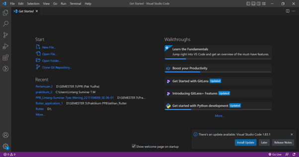
 

2. Kemudian klik "View" terus klik "Command Palette" atau dapat menekan Ctrl + Shift + P
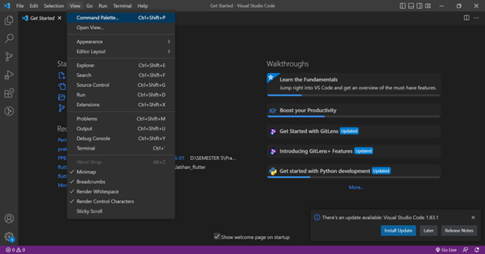
 

3. Lalu pilih extension flutter ("Flutter: New Project")
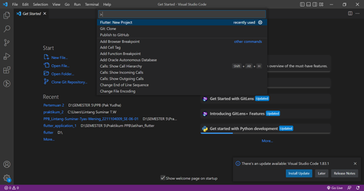
 

4. Setelah itu pilih template flutter yang "Application"
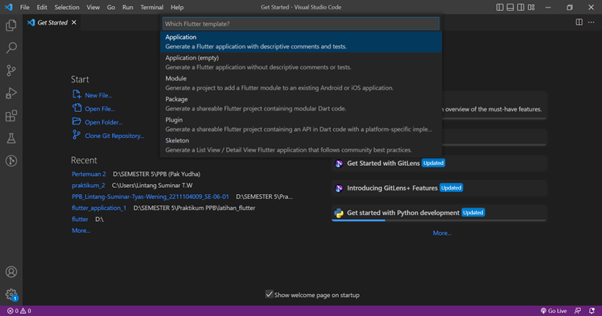
 

5. Kemudian pilih lokasi file yang akan disimpan
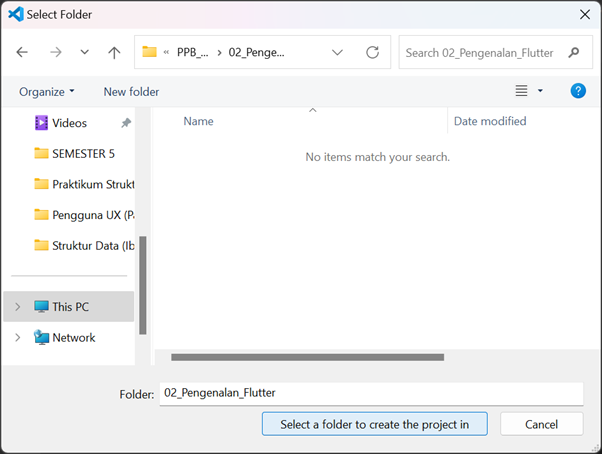
 

6. Selanjutnya masukkan nama folder atau nama file project kalian
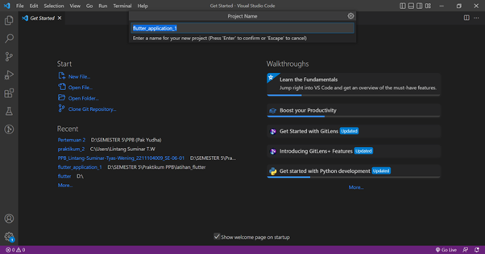
 

7. Kemudian tunggu hasil file project flutter, seperti tampilan dibawah ini
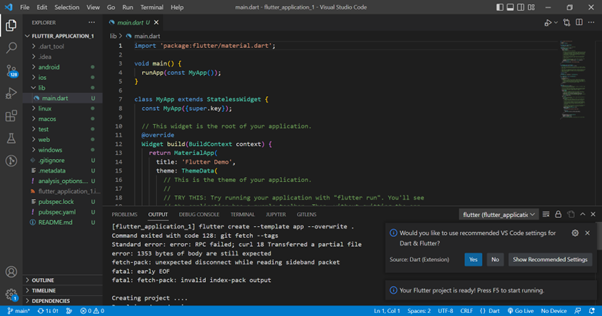
 

## *3. Setelah project dibuat, jalankan di emulator atau pada real device (jika pada tampilan telah keluar project Flutter seperti gambar di bawah, maka telah berhasil).*
8. Lanjutan dari pembuatan project maka pilih emulator atau device untuk dapat menjalankan projectnya/programnya
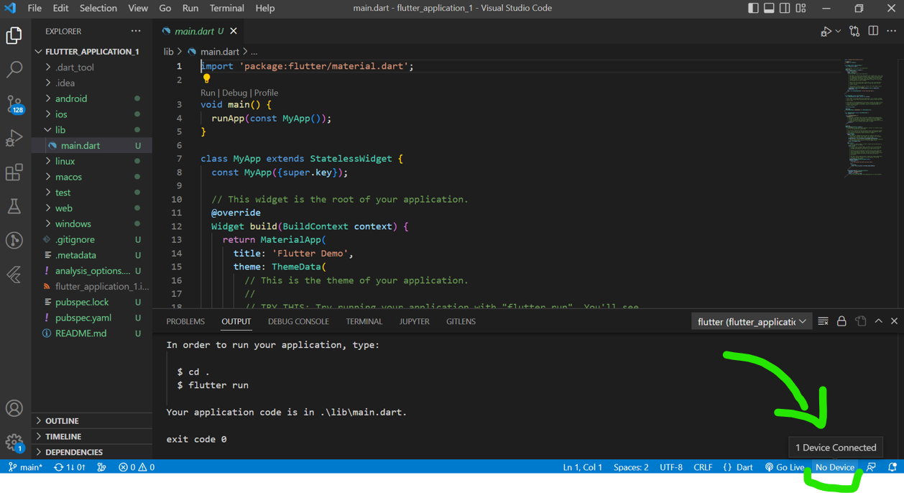
 

9. Kemudian pilih emulator/device sesuai kebutuhan kalian
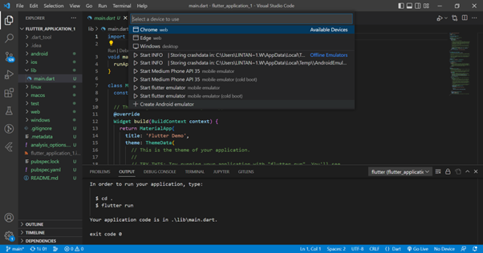
 

10. Kemudian program akan berjalan sesuai emulator yang kalian pilih, jika sudah selesai maka tampillannya seperti ini 
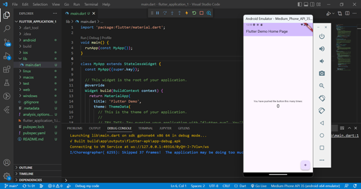
 

## *4. Setelah berhasil, modifikasi halaman diatas untuk menampilkan biodata kalian, minimal 5 widget!! (bebas, buatlah sekreatif mungkin)*
<li> Hasil Modifikasi

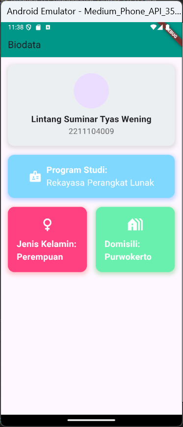
 
<li> Hasil Source Code

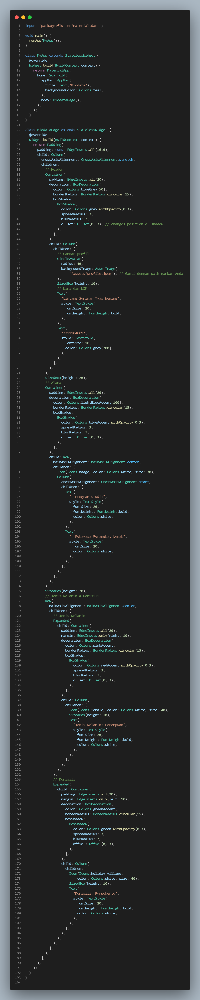

