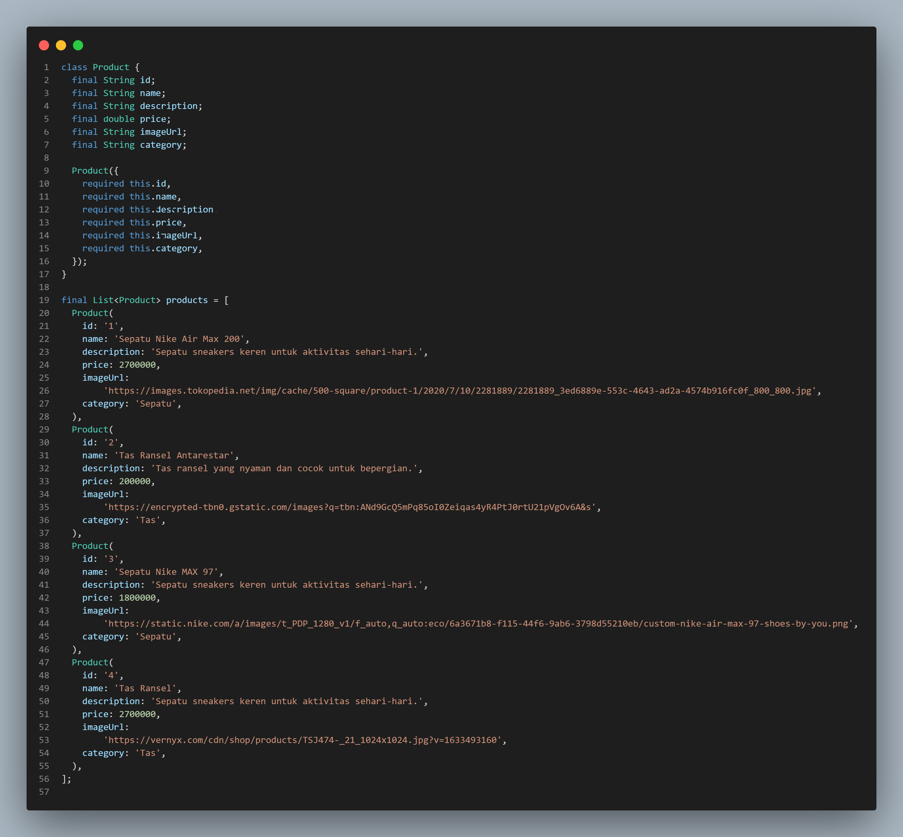
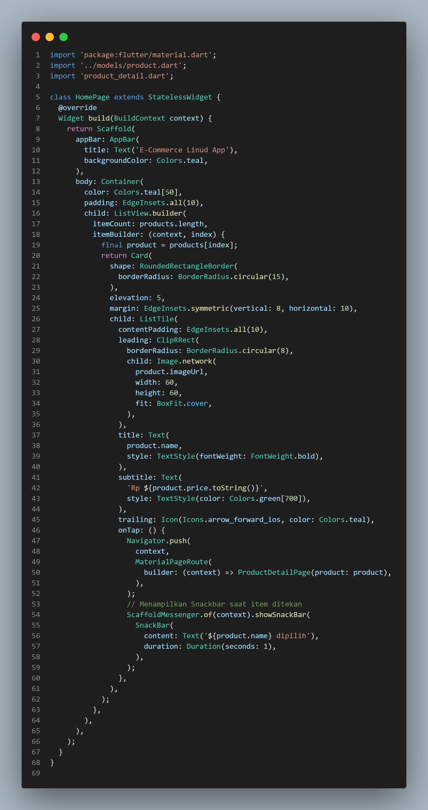
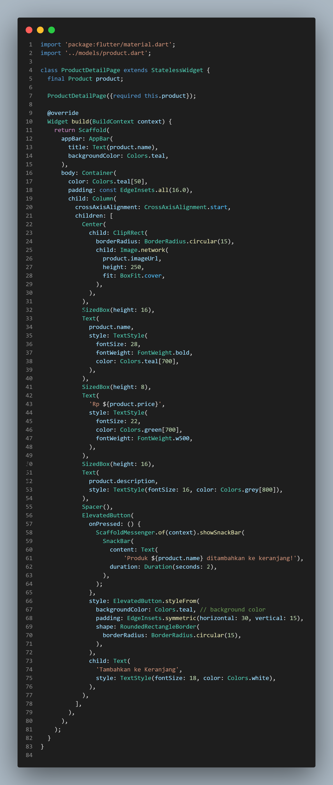
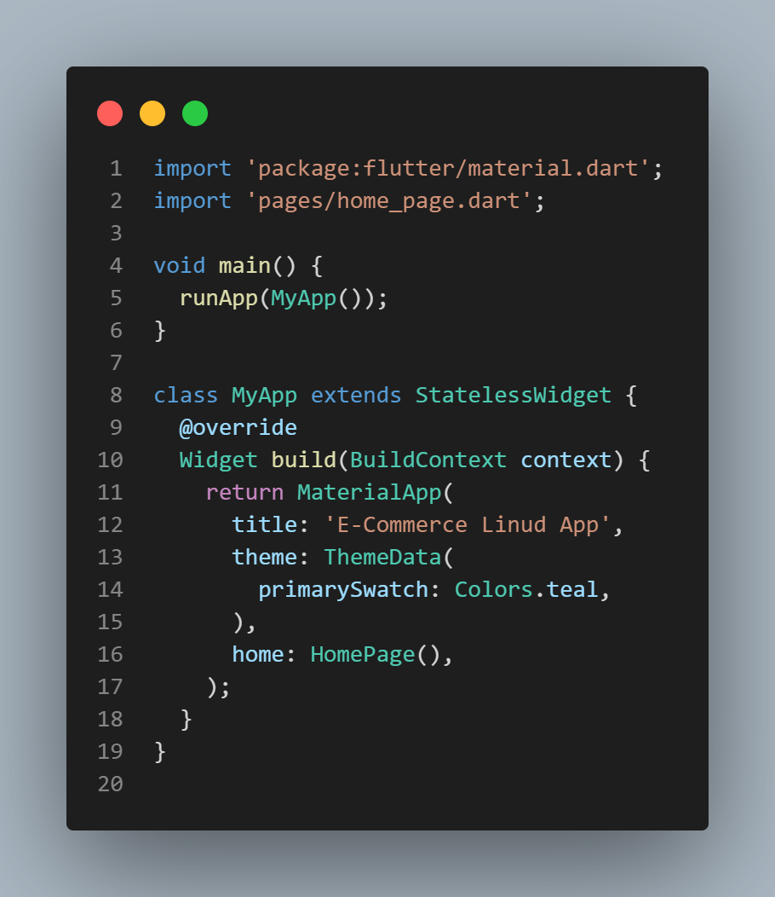

# PPB_Lintang-Suminar-Tyas-Wening_2211104009/07_Navigasi_dan_Notifikasi/Unguided

**LAPORAN PRAKTIKUM**  
**PEMOGRAMAN PERANGKAT BERGERAK**  
**MODUL 7**  

Oleh: 
Lintang Suminar Tyas Wening 
2211104009 
SE-06-01 
 
 

**PRODI S1 REKAYASA PERANGKAT LUNAK**  
**FAKULTAS INFORMATIKA**  
**TELKOM UNIVERSITY PURWOKERTO**  
**2024**  

---

## UNGUIDED
**Tugas Mandiri**  
<li> (Soal)Buatlah satu project untuk menampilkan beberapa produk dan halaman e-commerce dengan menerapkan class model serta navigasi halaman.  
_Note: Jangan lupa sertakan source code, screenshoot output, dan deskripsi program. Kreatifitas menjadi nilai tambah._

**Jawaban**
1. `models/product.dart`, file ini berisi class `Product` untuk merepsentasikan data produk
<li> Source Code pada `product.dart` :

 

2. `pages/home_page.dart`, halaman ini menampilkan daftar produk. Ketika pengguna mengklik produk, akan diarahkan ke halaman detail produk
<li> Source Code pada `home_page.dart` :

 

3. `pages/product_detail.dart`, halaman ini menampilkan detail produk yang dipilih, seperti gambar, deskripsi, dan harga
<li> Source Code pada `product_detail.dart` :

 

4. `main.dart`, file utama yang mengatur navigasi ke halaman HomePage
<li> Source Code pada `main.dart`:

 

<li> Screenshot Output : 
<li> Tampilan Home  
  
  
<li> Tampilan ketika pengguna mengklik produk maka yang diklik nanti akan muncul tampilan notifikasi (snackbar) dibagian bawah  
  
.png  
<li> Tampilan Detail Produk  
  
  
<li> Tampilan ketika pengguna mengklik "Tambahkan ke Keranjang" maka yang dklik akan muncul tampilan notifikasi (snackbar) dibagian bawah  

.png)  

<li> Deskripsi Program :
Aplikasi e-commerce ini menampilkan daftar produk sepatu dan tas dengan struktur navigasi utama yang menghubungkan halaman utama dan halaman detail produk. Data produknya sendiri disimpan dalam file models/product.dart, dengan kelas Product yang punya beberapa atribut kayak nama, harga, deskripsi, dan link gambar. Di Homepage, produk ditampilkan dalam widget card (bentuk kartu) terus kalau kita klik cardnya maka pindahkan ke halaman detail produknya. Di halaman detail ada tombol 'Tambahkan ke Keranjang' yang kalau diklik bakal muncul notifikasi singkat (SnackBar). Tampilan keseluruhan aplikasi ini didominasi warna teal agar dapat memberikan kesan modern dan user-friendly.
