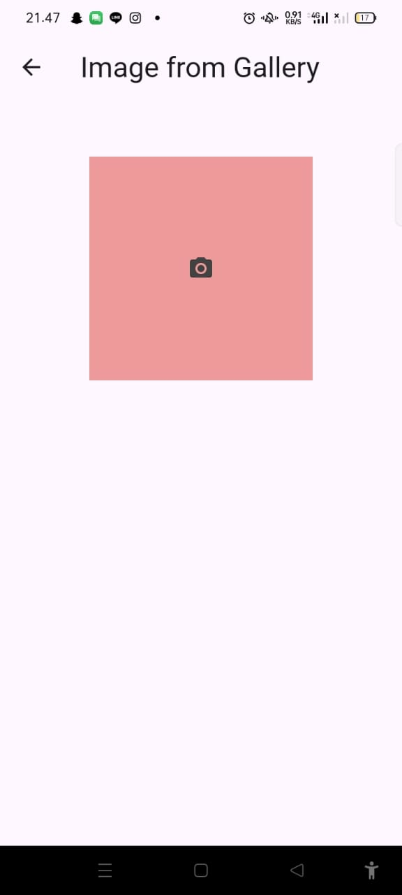

# PPB_Lintang-Suminar-Tyas-Wening_2211104009/09_API_Perangkat_Keras/Guided

**LAPORAN PRAKTIKUM**  
**PEMOGRAMAN PERANGKAT BERGERAK**  
**MODUL 9**  

Oleh: 
Lintang Suminar Tyas Wening 
2211104009 
SE-06-01 
 
 

**PRODI S1 REKAYASA PERANGKAT LUNAK**  
**FAKULTAS INFORMATIKA**  
**TELKOM UNIVERSITY PURWOKERTO**  
**2024**  

---
# GUIDED
**SOURCE CODE PRAKTIKUM DIKELAS**
<li> Source Code Main Dart

  

<li> Source Code Image Picker

  

<li> Source Code MyApi Page

  

**SCREENSHOT OUTPUT PRAKTIKUM DIKELAS**
<li> Screenshot Tampilan Main

  

<li> Screenshot Tampilan Camera API (Saat sebelum di klik ikon kamera dan Mengambil Gambar dari Kamera)

  

<li> Screenshot Tampilan Display Camera API (Saat di klik ikon kamera maka muncul displaynya)

   

<li> Screenshot Tampilan Media API (Mengambil Gambar dari Galeri)

  

<li> Screenshot Tampilan Media Galeri API (Mengambil File Gambar dari Galeri)

  

<li> Screenshot Tampilan Hasil Media Galeri API (Telah terupload atau terunggah) 

