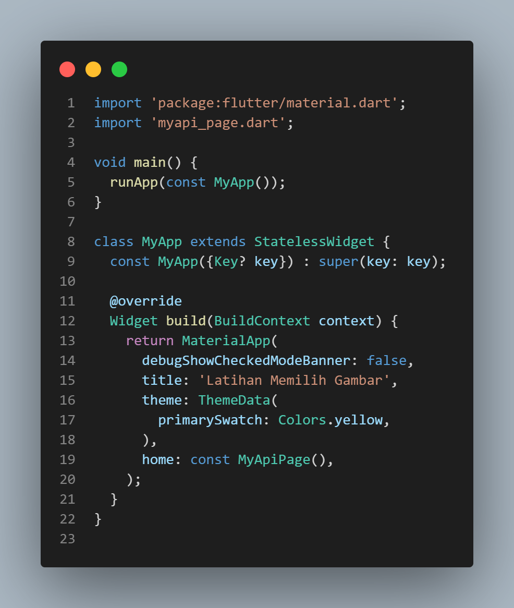
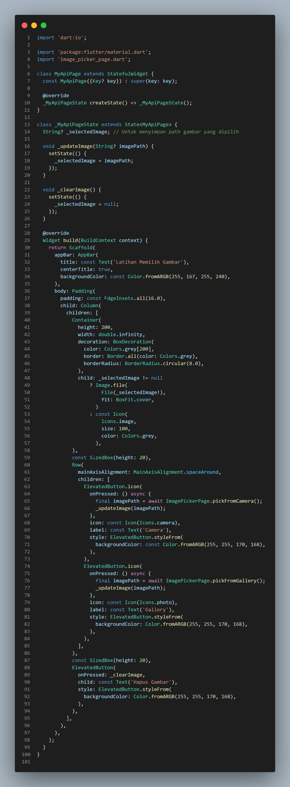
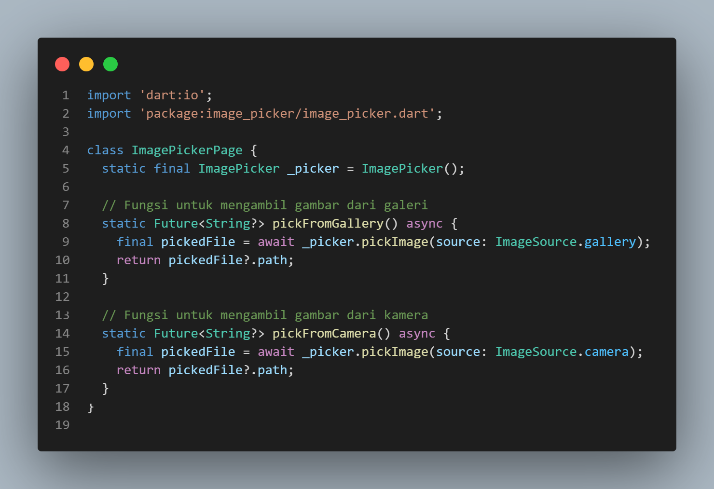
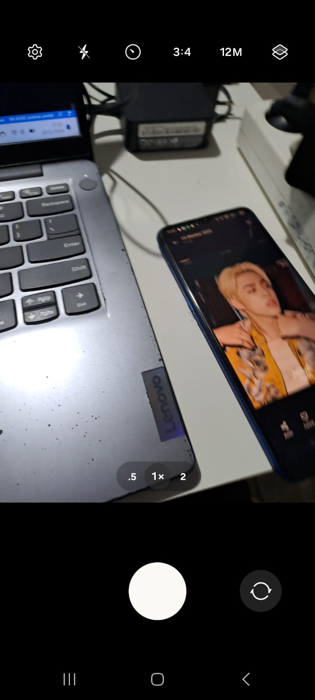
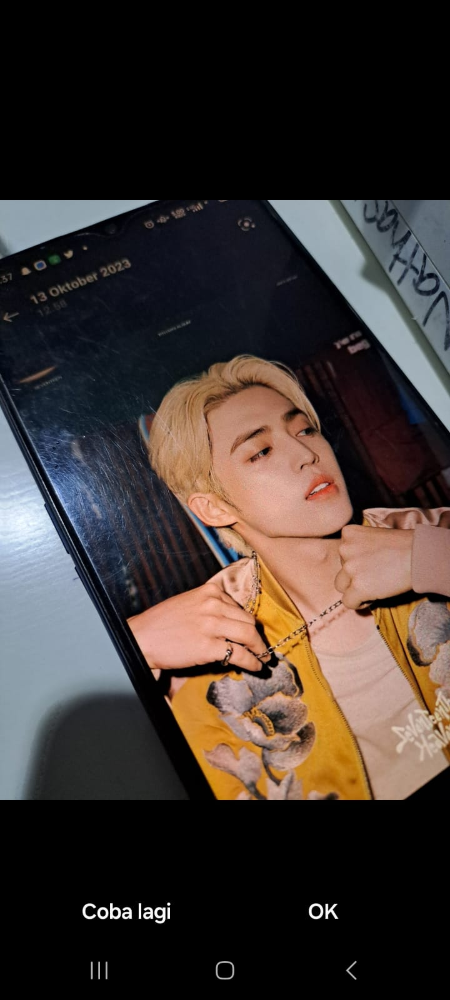
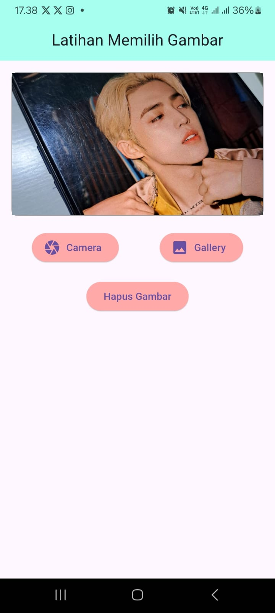
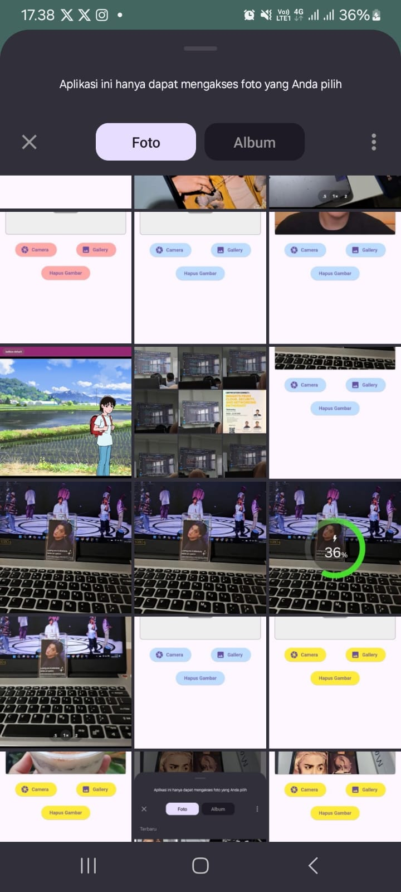
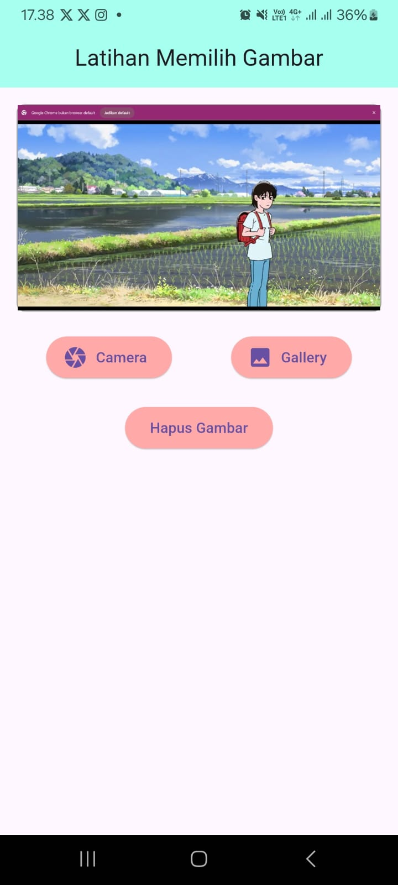
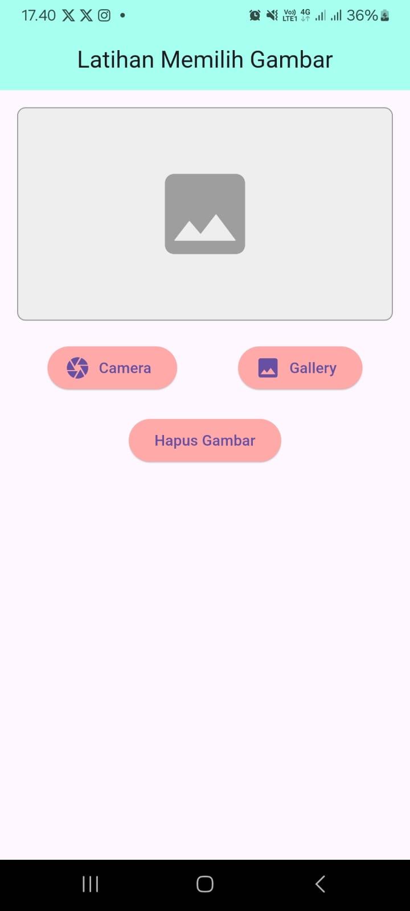

# PPB_Lintang-Suminar-Tyas-Wening_2211104009/09_API_Perangkat_Keras/Unguided

**LAPORAN PRAKTIKUM**  
**PEMOGRAMAN PERANGKAT BERGERAK**  
**MODUL 9**  

Oleh: 
Lintang Suminar Tyas Wening 
2211104009 
SE-06-01 
 
 

**PRODI S1 REKAYASA PERANGKAT LUNAK**  
**FAKULTAS INFORMATIKA**  
**TELKOM UNIVERSITY PURWOKERTO**  
**2024**  

---

## UNGUIDED
**Tugas Mandiri**  
1. (Soal)Modifikasi project pemilihan gambar yang telah dikerjakan pada Tugas Pendahuluan Modul 09 agar fungsionalitas tombol dapat berfungsi untuk mengunggah gambar.
<li> Ketika tombol Gallery ditekan, aplikasi akan mengambil gambar dari galeri, dan setelah gambar dipilih, gambar tersebut akan ditampilkan di dalam container.  
<li> Ketika tombol Camera ditekan, aplikasi akan mengambil gambar menggunakan kamera, dan setelah pengambilan gambar selesai, gambar tersebut akan ditampilkan di dalam container.  
<li> Ketika tombol Hapus Gambar ditekan, gambar yang ada pada container akan dihapus.  
_Note: Jangan lupa sertakan source code, screenshoot output, dan deskripsi program. Kreatifitas menjadi nilai tambah._

**Jawaban**
<li> Source Code pada `main.dart` :

 

<li> Source Code pada `myapi_page.fart` :

 

<li> Source Code pada `Image_Picker.dart` :

 

<li> Screenshot Output : 
<li> Tampilan Awal 
  
  

<li> Tampilan ketika pengguna mengklik camera  
  
  

<li> Tampilan Camera saat sudah diklik atau difoto  
  
  

<li> Tampilan camera yang sudah difoto akan muncul di containernya  

  

<li> Tampilan ketika pengguna mengklik galery 

  

<li> Tampilan galery yang sudah dipilih dan diklik akan muncul di containernya  

  

<li> Tampilan ketika pengguna mengklik button hapus maka gambar yang muncul di container akan terhapus  

  

<li> Deskripsi Program :
Aplikasi ini punya tiga tombol utama. Tombol Gallery dipakai buat pilih gambar dari galeri lewat metode ImagePicker.pickFromGallery(). Kalau gambar udah dipilih, langsung ditampilkan di container. Tombol Camera buat ambil gambar pake kamera lewat metode ImagePicker.pickFromCamera(), hasilnya juga langsung muncul di container. Tombol Hapus Gambar dipakai buat menghapus gambar dari container dengan manggil fungsi _clearImage(). Gambar yang dipilih atau diambil ditampilkan pake widget Image.file() di container yang udah disiapin.
