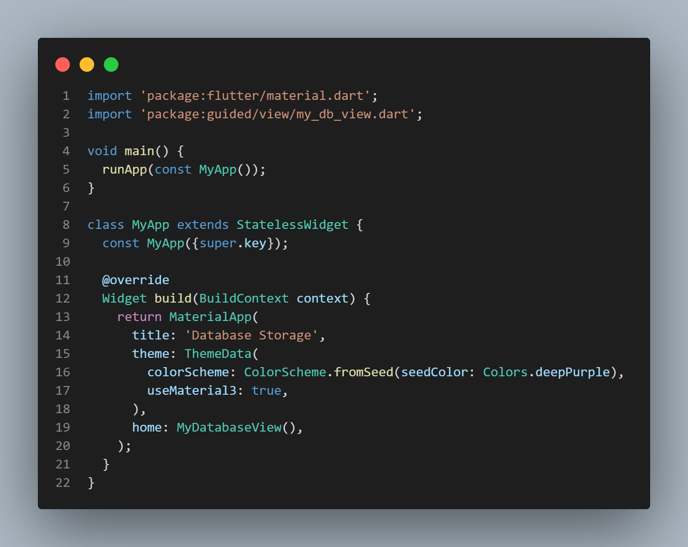
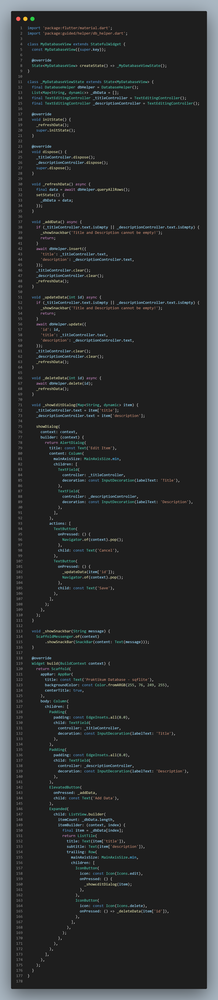
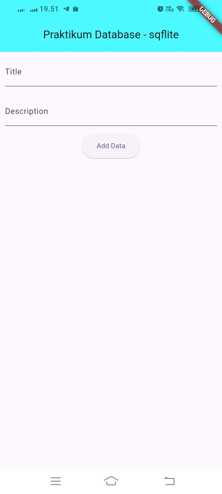
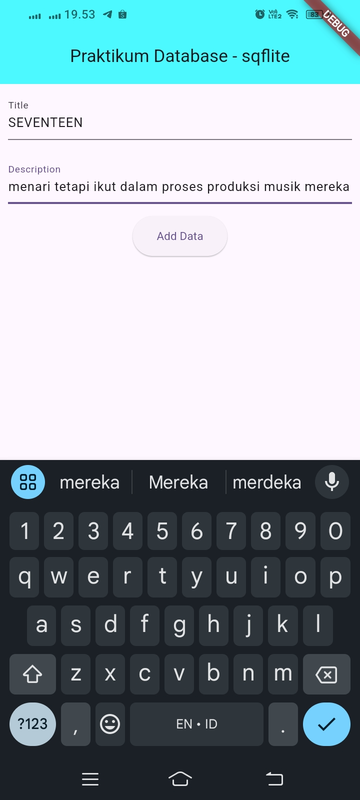
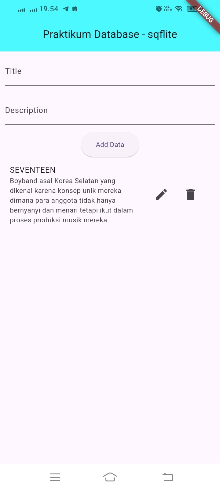
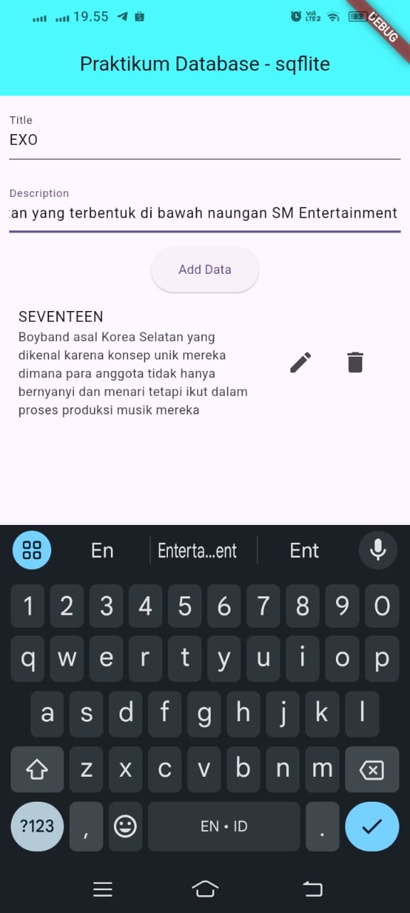
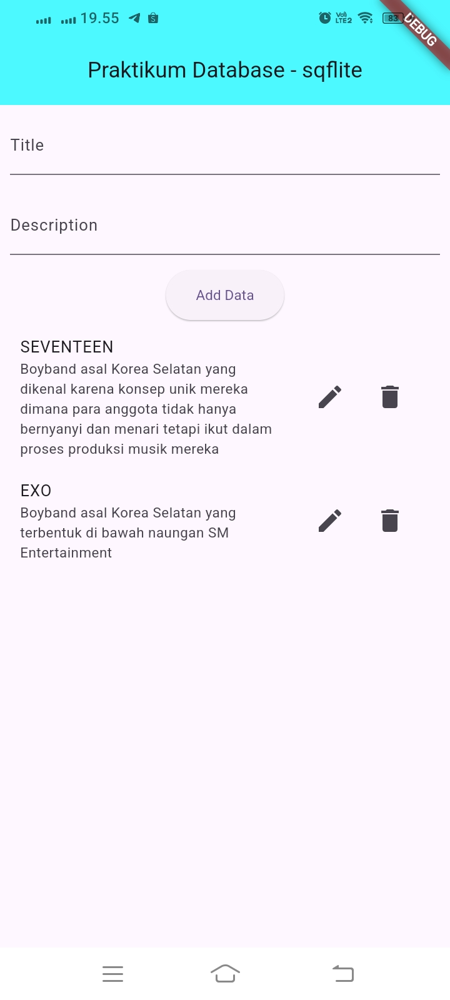
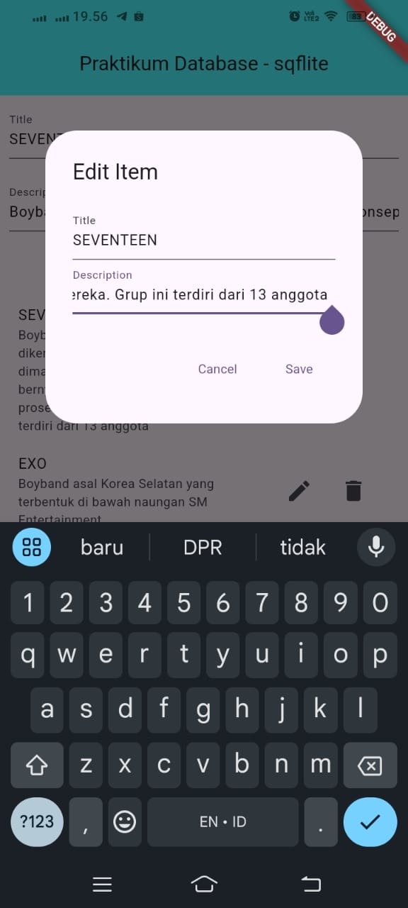
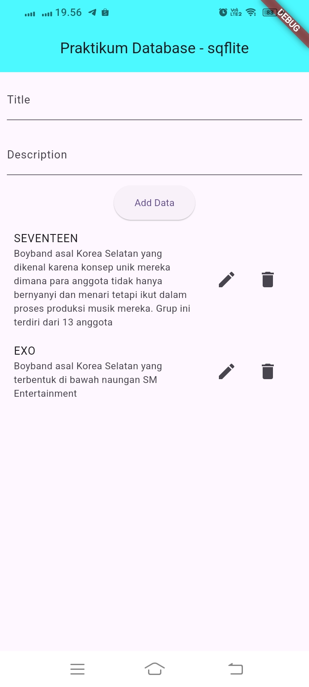
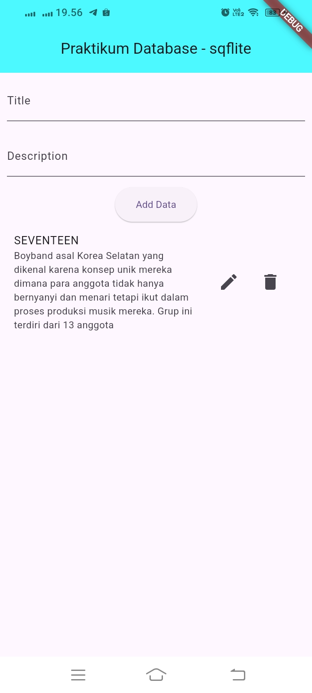

# PPB_Lintang-Suminar-Tyas-Wening_2211104009/10_Data_Storage_Bagian_1/Guided

**LAPORAN PRAKTIKUM**  
**PEMOGRAMAN PERANGKAT BERGERAK**  
**MODUL 10**  

Oleh: 
Lintang Suminar Tyas Wening 
2211104009 
SE-06-01 
 
 

**PRODI S1 REKAYASA PERANGKAT LUNAK**  
**FAKULTAS INFORMATIKA**  
**TELKOM UNIVERSITY PURWOKERTO**  
**2024**  

---
# GUIDED
**SOURCE CODE PRAKTIKUM DIKELAS**
<li> Source Code Main Dart

  

<li> Source Code my_db_view

  

<li> Source Code db_helper

  

**SCREENSHOT OUTPUT PRAKTIKUM DIKELAS**
<li> Screenshot Tampilan Awal atau Halaman Utama

 

<li> Screenshot tampilan ketika pengguna mengetik title dan description

  

<li> Screenshot Tampilan teks yang sudah diketik dan muncul dihalaman utama

  

<li> Screenshot tampilan  pengguna dapat menambah title dan description untuk bagian yang kedua

  

<li> Screenshot Tampilan teks untuk bagian kedua yang sudah diketik dan muncul dihalaman utama

  

<li> Screenshot Tampilan Pengguna dapat mengedit title dan description

  

<li> Screenshot Tampilan hasil edit yang telah dilakukan

  

<li> Screenshot Tampilan ketika pengguna ingin menghapus salah satu teks

