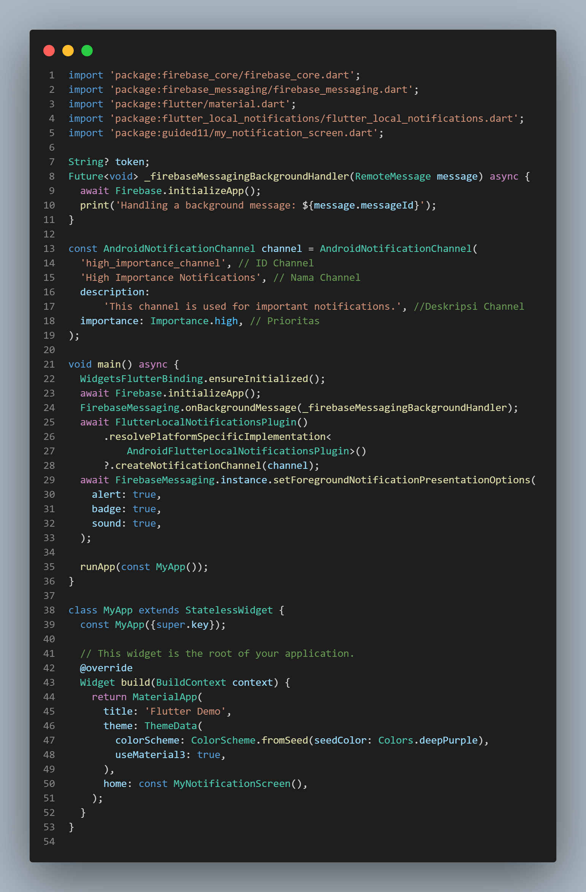
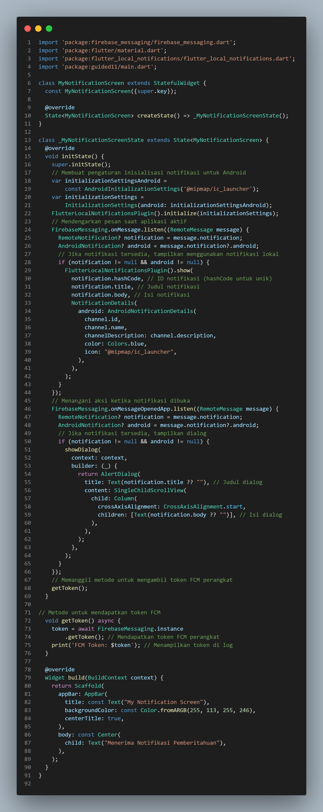
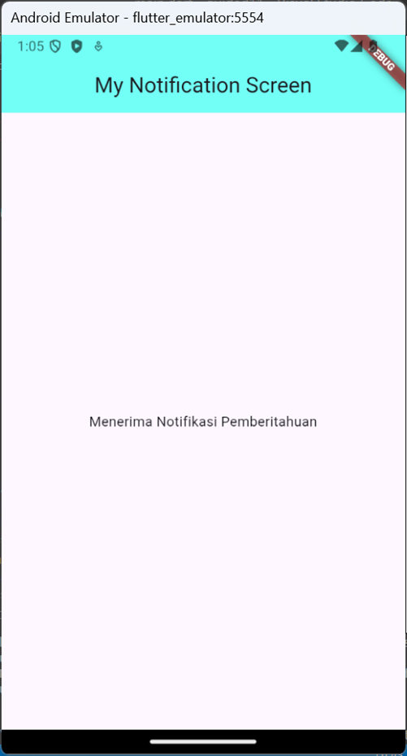
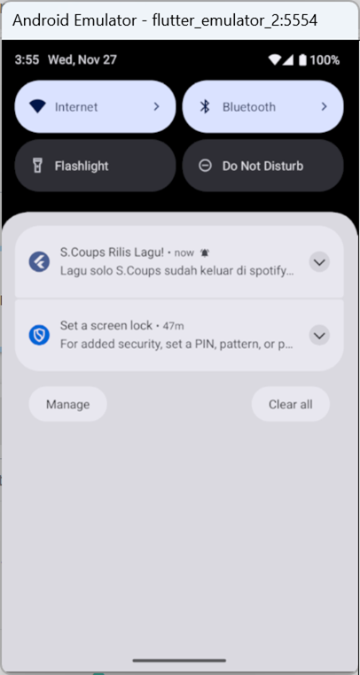
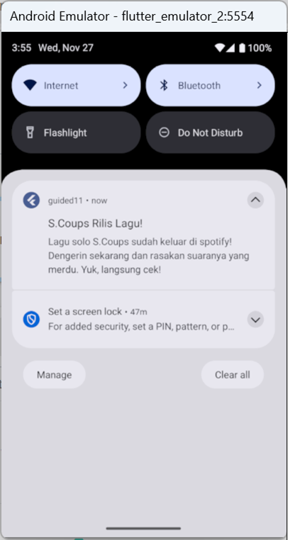
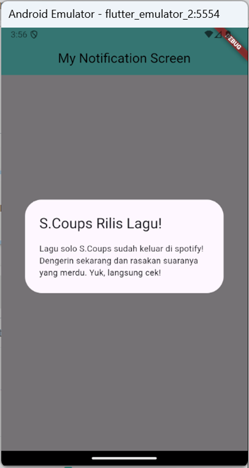

# PPB_Lintang-Suminar-Tyas-Wening_2211104009/11_Data_Storage_Bagian_2/Guided

**LAPORAN PRAKTIKUM**  
**PEMOGRAMAN PERANGKAT BERGERAK**  
**MODUL 11**  

Oleh: 
Lintang Suminar Tyas Wening 
2211104009 
SE-06-01 
 
 

**PRODI S1 REKAYASA PERANGKAT LUNAK**  
**FAKULTAS INFORMATIKA**  
**TELKOM UNIVERSITY PURWOKERTO**  
**2024**  

---
# GUIDED
**SOURCE CODE PRAKTIKUM DIKELAS**
<li> Source Code Main Dart

  

<li> Source Code my_notification_screen

  

**SCREENSHOT OUTPUT PRAKTIKUM DIKELAS**
<li> Screenshot tampilan Awal atau Halaman Muka

  

<li> Screenshot tampilan saat notifikasi muncul di layar

  

<li> Screenshot tampilan ketika notifikasinya di klik untuk melihat detail notif

  

<li> Screenshot tampilan yang muncul setelah sebuah notifikasi diketuk atau diklik

  

