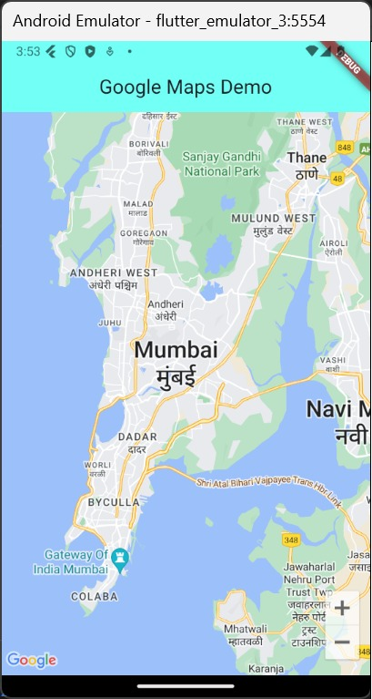

# PPB_Lintang-Suminar-Tyas-Wening_2211104009/12_Maps_Places_Firebase_Notification/Guided

**LAPORAN PRAKTIKUM**  
**PEMROGRAMAN PERANGKAT BERGERAK**  
**MODUL 12**  

Oleh: 
Lintang Suminar Tyas Wening 
2211104009 
SE-06-01 
 
 

**PRODI S1 REKAYASA PERANGKAT LUNAK**  
**FAKULTAS INFORMATIKA**  
**TELKOM UNIVERSITY PURWOKERTO**  
**2024**  

---
# GUIDED
**SOURCE CODE PRAKTIKUM DIKELAS**
<li> Source Code Main Dart

  

<li> Source Code mainpage

  

**SCREENSHOT OUTPUT PRAKTIKUM DIKELAS**
<li> Screenshot tampilan awal Google Maps

  
