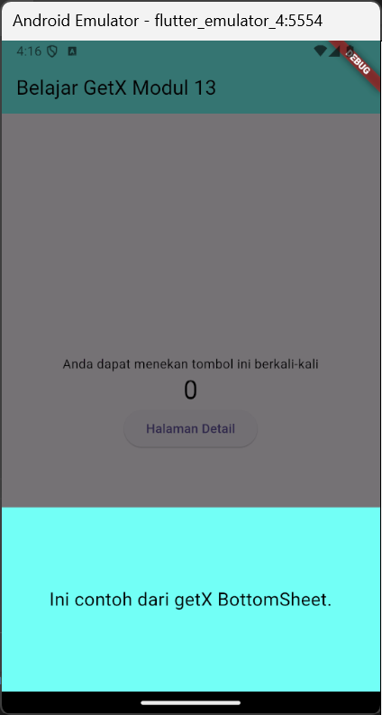

# PPB_Lintang-Suminar-Tyas-Wening_2211104009/13_Networking/Guided

**LAPORAN PRAKTIKUM**  
**PEMROGRAMAN PERANGKAT BERGERAK**  
**MODUL 13**  

Oleh: 
Lintang Suminar Tyas Wening 
2211104009 
SE-06-01 
 
 

**PRODI S1 REKAYASA PERANGKAT LUNAK**  
**FAKULTAS INFORMATIKA**  
**TELKOM UNIVERSITY PURWOKERTO**  
**2024**  

---
# GUIDED
**SOURCE CODE PRAKTIKUM DIKELAS**
<li> Source Code Main Dart

  

<li> Source Code homepage

  

<li> Source Code detail page

  

<li> Source Code counter controller ketika mengklik ikon "-" hasilnya langsung 0

  

<li> Source Code counter cpntroller ketika mengklik ikon "-" hasilnya berkurang 1

  

**SCREENSHOT OUTPUT PRAKTIKUM DIKELAS**
<li> Screenshot tampilan awal GetX

  

<li> Screenshot tampilan saat mengklik ikon "+" agar angka atau nilai nya dapat diubah, misalnya sebanyak 10 kali 

  

<li> Screenshot tampilan saat mengklik ikon "-" 

  

<li> Screenshot tampilan saat mengklik halaman detail

  

<li> Screenshot tampilan adanya ikon snackbar (message) di halaman utama

  

<li> Screenshot tampilan saat di klik ikon snackbar akan muncul notif atau pesan dibagian atas

  

<li> Screenshot tampilan adanya ikon GetBottomSheet (note_add_rounded) di halaman utama

  

<li> Screenshot tampilan saat di klik ikon getbottomsheet akan muncul teks dibagian bawah 

  

