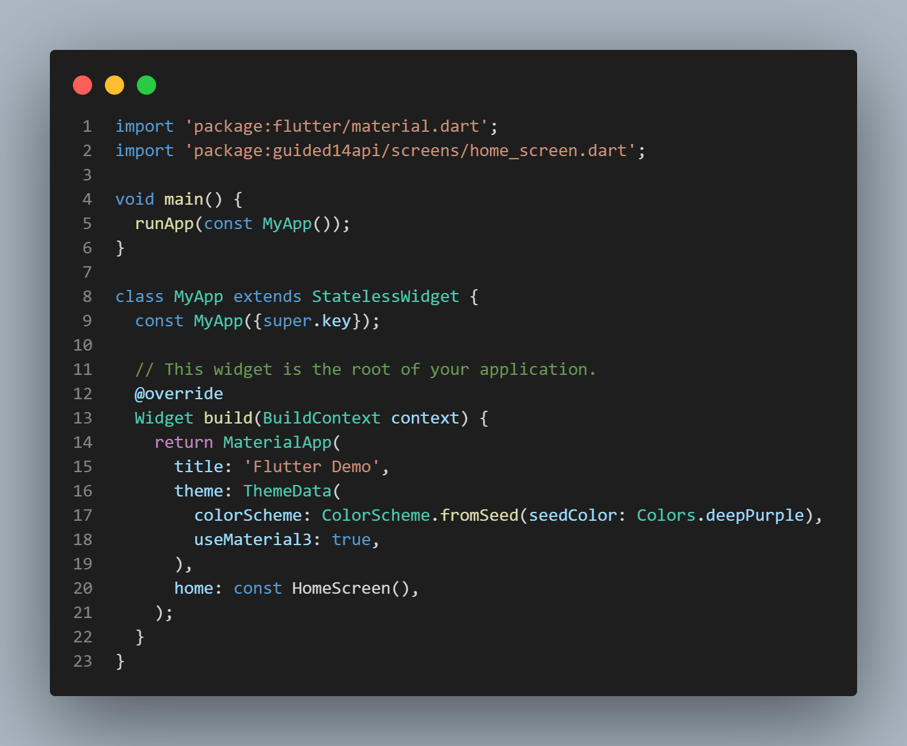
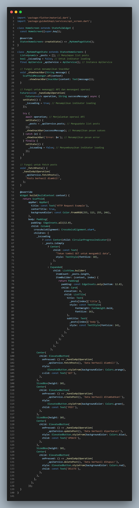
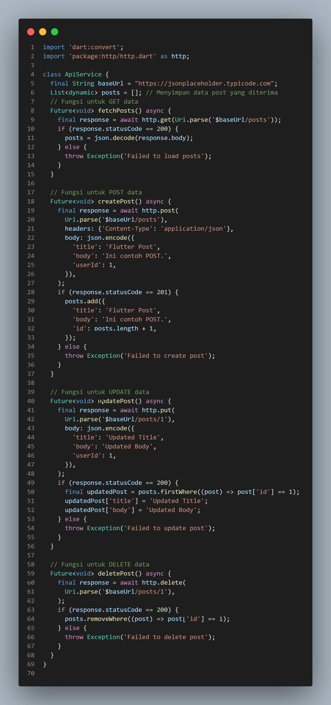
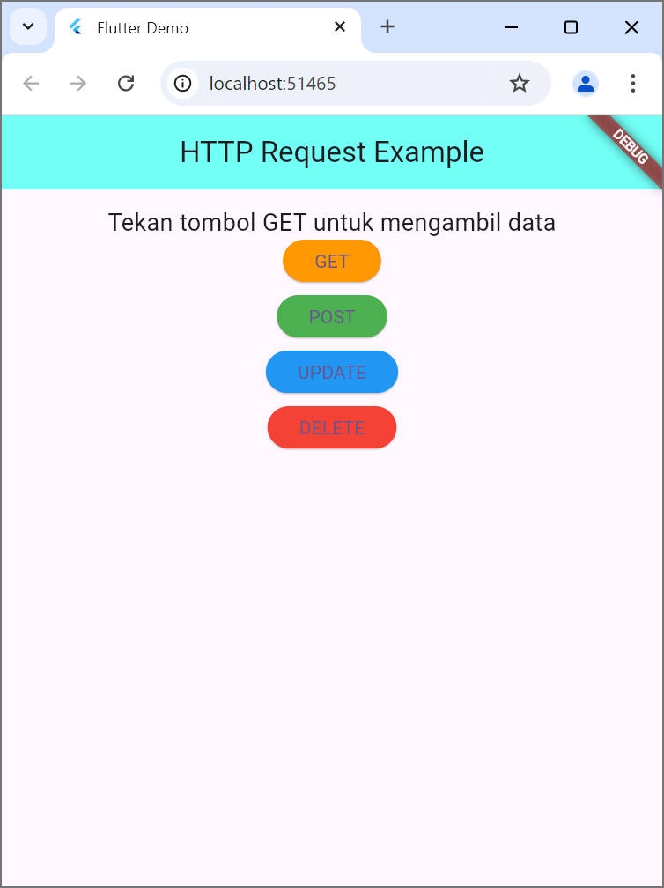
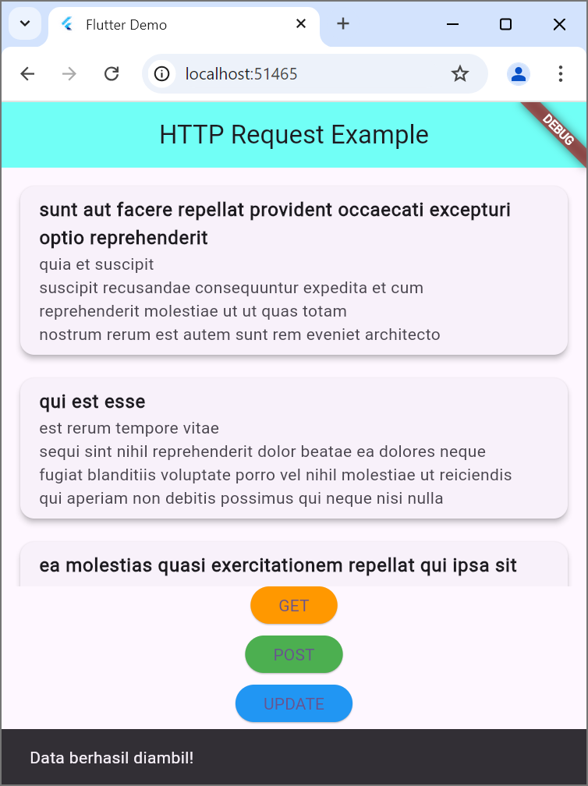
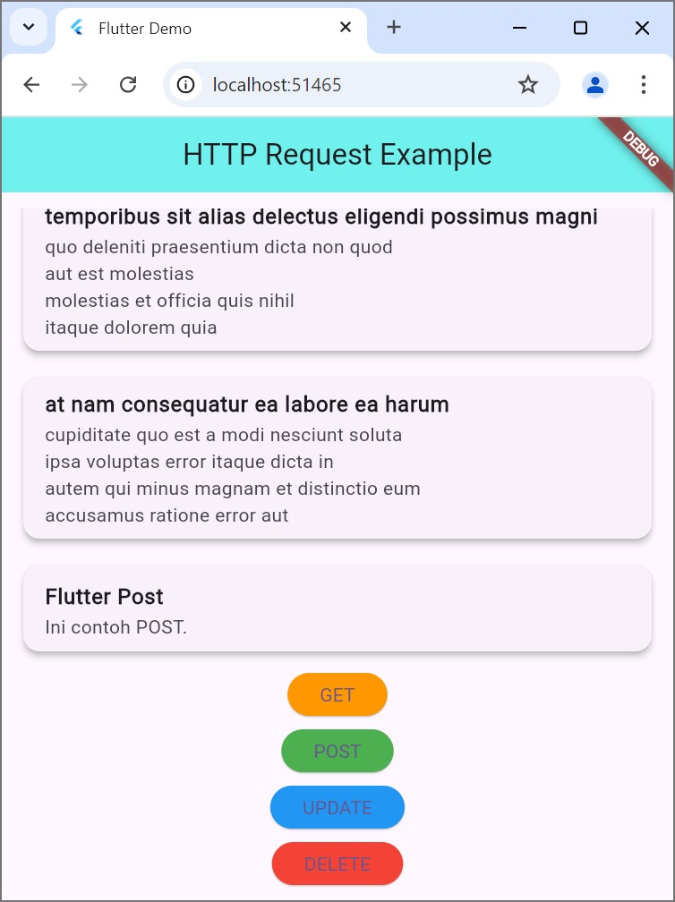
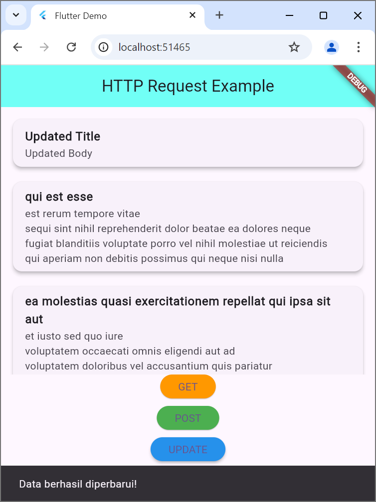
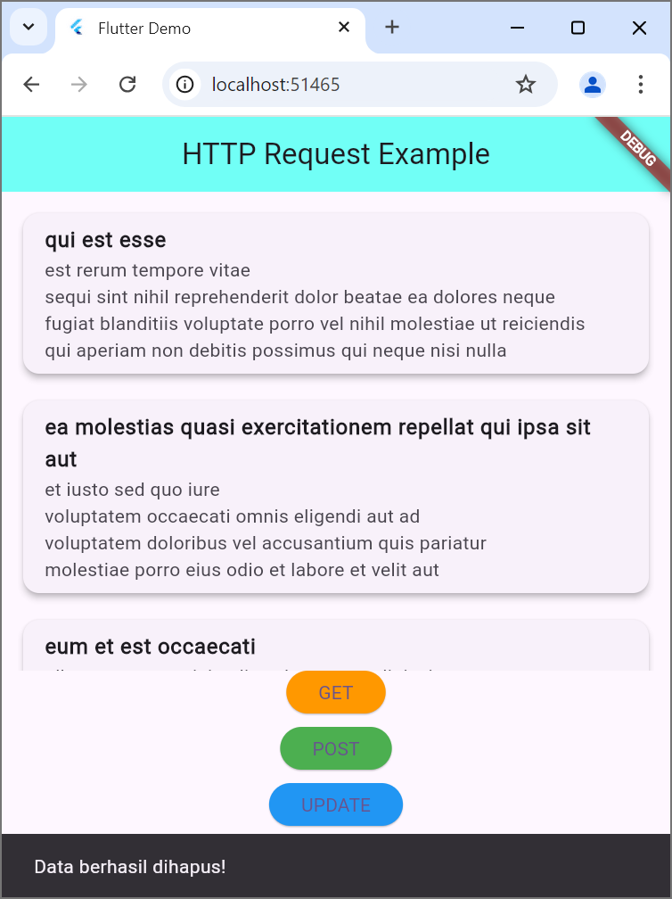

# PPB_Lintang-Suminar-Tyas-Wening_2211104009/14_Data_Storage_Bagian_3/Guided

**LAPORAN PRAKTIKUM**  
**PEMROGRAMAN PERANGKAT BERGERAK**  
**MODUL 14**  

Oleh: 
Lintang Suminar Tyas Wening 
2211104009 
SE-06-01 
 
 

**PRODI S1 REKAYASA PERANGKAT LUNAK**  
**FAKULTAS INFORMATIKA**  
**TELKOM UNIVERSITY PURWOKERTO**  
**2024**  

---
# GUIDED
**SOURCE CODE PRAKTIKUM DIKELAS**
<li> Source Code Main Dart

  

<li> Source Code homescreen

  

<li> Source Code API Screen

  

**SCREENSHOT OUTPUT PRAKTIKUM DIKELAS**
<li> Screenshot tampilan awal HTTP REQUEST EXAMPLE

  

<li> Screenshot tampilan saat mengklik button "GET"

  

<li> Screenshot tampilan saat mengklik button "POST"

  

<li> Screenshot tampilan saat mengklik button "UPDATE"

  

<li> Screenshot tampilan saat mengklik button "DELETE"

  

**DESKRIPSI PROGRAM**  
Program ini adalah contoh implementasi Flutter untuk melakukan operasi HTTP (GET, POST, UPDATE, DELETE) terhadap API menggunakan ApiService. Data yang diambil disimpan dalam _posts dan ditampilkan sebagai daftar. Program memanfaatkan fungsi _handleApiOperation untuk menangani operasi API, menampilkan indikator loading, dan memberi notifikasi sukses atau error dengan SnackBar. Antarmukanya mencakup tombol untuk setiap operasi HTTP dengan warna berbeda, indikator loading, dan daftar data yang diperbarui secara otomatis. 

Layanan API dijalankan menggunakan bahasa Dart dan package http untuk menangani operasi HTTP terhadap API publik https://jsonplaceholder.typicode.com. Fungsi fetchPosts mengambil data dari server dan menyimpannya ke dalam daftar posts, fungsi createPost mengirimkan data baru ke server sekaligus memperbarui daftar lokal, fungsi updatePost memperbarui data tertentu (ID 1) di server, sedangkan deletePost menghapus data berdasarkan ID yang sama. Program memeriksa status HTTP untuk memastikan setiap operasi berhasil dan melempar exception jika terjadi kesalahan. Untuk pengembangan lebih lanjut, aplikasi dapat ditingkatkan dengan penggunaan ID dinamis atau fitur caching data.
